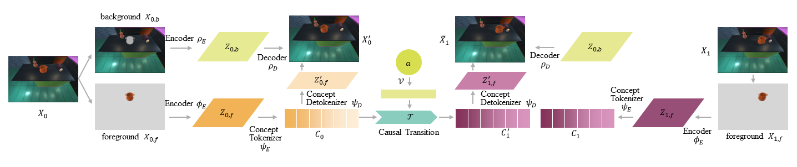

<center style="font-weight: bold"> </center>

<div style="display: flex; justify-content: center; align-items: center;">
  <span class="link-block" style="text-align: center; display: block; margin: 0 10px;">
    <a href="" target="_blank" class="external-link button is-normal is-rounded is-dark">
      <span class="icon">
        <i class="fab fa-github"></i>
      </span>
      <span>Code (Coming Soon)</span>
    </a>
  </span>
  <span class="link-block" style="text-align: center; display: block; margin: 0 10px;">
    <a href="https://arxiv.org/abs/2310.03325" target="_blank" class="external-link button is-normal is-rounded is-dark">
      <span class="icon">
        <i class="far fa-file-alt"></i>
      </span>
      <span>Paper</span>
    </a>
  </span>
  <span class="link-block" style="text-align: center; display: block; margin: 0 10px;">
    <a href="" target="_blank" class="external-link button is-normal is-rounded is-dark">
      <span class="icon">
        <i class="fa fa-database"></i>
      </span>
      <span>Dataset (Comming Soon)</span>
    </a>
  </span>
</div>


<!-- <p align="center">
    <a href='https://github.com/jiemingcui/probio/', target="_blank">[Code]
    </a>
    <a href='https://arxiv.org/abs/<ARXIV PAPER ID>', target="_blank">[ArXiv]
    </a>
</p> -->
<!-- Github link -->

<br>


Visual planning simulates how humans make decisions to achieve desired goals in the form of searching for visual causal transitions between an initial visual state and a final visual goal state. It has become increasingly important in egocentric vision with its advantages in guiding agents to perform daily tasks in complex environments. In this paper, we propose an interpretable and generalizable visual planning framework consisting of **i)** a novel Substitution-based Concept Learner (**SCL**) that abstracts visual inputs into disentangled concept representations, **ii)** symbol abstraction and reasoning that performs task planning via the self-learned symbols, and **iii)** a Visual Causal Transition model (**ViCT**) that grounds visual causal transitions to semantically similar real-world actions. Given an initial state, we perform goal-conditioned visual planning with a symbolic reasoning method fueled by the learned representations and causal transitions to reach the goal state. To verify the effectiveness of the proposed model, we collect a large-scale visual planning dataset based on AI2-THOR, dubbed as *CCTP*. Extensive experiments on this challenging dataset demonstrate the superior performance of our method in visual task planning. Empirically, we show that our framework can generalize to unseen task trajectories, unseen object categories, and real-world data. Further details of this work are provided at `https://fqyqc.github.io/ConTranPlan/`.


<hr>

## Video

<div class="extensions extensions--video">
<iframe width="920" height="580" src="https://www.youtube.com/embed/qWfZV8vI7Q0?si=5GW1vR6FMVvIRERa" title="YouTube video player" allow="accelerometer; autoplay; clipboard-write; encrypted-media; gyroscope; picture-in-picture; web-share" frameborder="0" scrolling="no" allowfullscreen></iframe>
</div>

<hr>

## Framework

### Substitution-based Concept Learner (SCL)

<div class="card bg-light border-light mb-3">
    
    <div class="card-body">
      <h5 class="card-title">Figure 1. Architecture of SCL.</h5>
    </div>
</div>


### Symbol Abstraction and Reasoning

<div class="card bg-light border-light mb-3">
    
    <div class="card-body">
      <h5 class="card-title">Figure 2. Symbol Abstraction and Reasoning.</h5>
    </div>
</div>

### Visual Causal Transition Learning (ViCT)

<div class="card bg-light border-light mb-3">
    
    <div class="card-body">
      <h5 class="card-title">Figure 3. Architecture of ViCT.</h5>
    </div>
</div>


## Dataset

To facilitate the learning and evaluation of the concept-
based visual planning task, we collect a large-scale RGB-D
image sequence dataset named CCTP (Concept-based Causal
Transition Planning) based on AI2-THOR simulator.
We exclude scene transitions in each task by design to
focus more on concept and causal transition learning, i.e.,
each task is performed on a fixed workbench, although the
workbenches and scenes vary from task to task. The whole dataset consists
of a concept learning dataset and a visual causal planning
dataset.


<!-- ### Visualization of the ambiguous actions in BioLab. -->


<hr>

### Concept Revision Demo

<div class="card bg-light border-light mb-3">
    
    <div class="card-body">
      <h5 class="card-title">Figure 4. Fine-grained attribute level concept manipulation.</h5>
    </div>
</div>

<!-- ## Download

Our dataset is distributed under the [CC BY-NC-SA (Attribution-NonCommercial-ShareAlike)](https://creativecommons.org/licenses/by-nc-sa/4.0/) license. You can download our dataset from [Link here (Coming Soon)](). -->

<hr>

## Model Implementation Details

### Substitution-based concept learner
For 256×256 images, the encoder transforms them into 8×8 with 64 channels by a sequence of networks: 3 convolutional layers and 2 residual blocks, followed by another 4 convolutional layers and 2 residual blocks. The decoder involves 4 transposed convolutional layers and 2 residual blocks, followed by another 3 transposed convolutional layers and 2 residual blocks.
We use the architecture in VCT as our concept tokenizer and detokenizer. The concept number is set to 6.

### Symbol reasoning and visual causal transition
In the causal transition model, the action is initially embedded into a 64-dimensional vector, which is then concatenated with six separate 64-dimensional concept vectors. Following this, a four-layer MLP is applied for each concatenated vector to predict the six affected concept vectors.
The symbol-level transition model logs all the (input, action, output) triplets in the training data. It forecasts the probability distribution for all six affected concepts when provided with the input concept symbol and the action.

In the visual extraction process, the background encoder involves 3 convolutional layers and 2 residual blocks, transforming background images into 64×64 latent vectors with 64 channels. The background decoder involves two decoding modules and a transition module. The first decoding module has 4 convolutional layers and 2 residual blocks, decoding the front latent vectors into 64×64 with 64 channels. Then the transition module is applied, involving 3 convolutional layers and 3 transposed convolutional layers, converting the concatenated front and background vectors into the transitioned background latent vectors, which are 64×64 with 64 channels. After that, the transitioned background latent vectors are concatenated with the front latent vectors again, being fed into the second decoder module, which involves 3 transposed convolutional layers and 2 residual blocks and decodes the vectors into effect images.

During training, all models are optimized by Adam, with the start learning rate 10e-5 for concept tokenizer and detokenizer and 3e-4 for the rest models. We train our SCL for 180 epochs and our ViCT model for 70 epochs on a single NVIDIA RTX 3090 GPU.

### Baselines

**Reasoning applied on the continuous domains** In the generalization tests, we introduced two baselines that involve a reasoning process within continuous vectors. The "w/o. symbol" method employs our trained causal transition model to explore the action space, aiming to discover the action sequence that transforms the concept tokens closest to the goal state. The distance between concept tokens is measured using the l2-norm. Similarly, a causal transition model based on image vectors is trained for the "w/o. concept" method in later experiments. One significant drawback of these methods is that defining action validity becomes challenging. This implies that these methods might predict action sequences that move the target object outside the workbench, resulting in vectors that the transition model cannot comprehend.

**Reinforcement Learning** A goal-conditioned Double DQN agent is trained with prioritized experience replay to choose actions, taking the concept symbols of the current state and goal state given by our concept learner as inputs. We use our symbolic reasoning model to mimic the learning environment for the agent. The symbolic reasoning model applies the chosen action to the concept symbols and returns the concept symbols of the next state for the agent. The agent gets a reward of 1 only if the current concept symbols are equal to the goal state's symbols.

**PlaTe** PlaTe is a Transformer-based planning method that simultaneously learns an action predictor based on current and goal state features and a state predictor based on the predicted action and state features. We follow the official implementation of PlaTe and use a pre-trained ResNet-50 to extract 1024-d features of images of the target object, dyer, and obstacles separately as the input state features. We use the features of one image frame as one state. The model is trained without parameter tuning for 500 epochs on dataset *CCTP*.

**VCT** VCT is an unsupervised method to extract disentangled concepts from simple images. We trained a VCT model with our image encoder and decoder architectures on our concept dataset. It is capable of reconstructing the images well but fails to achieve disentanglement. 

<hr>

## Citation

```bibtex
@misc{qian2024learning,
  title={Learning Concept-Based Causal Transition and Symbolic Reasoning for Visual Planning}, 
  author={Yilue Qian and Peiyu Yu and Ying Nian Wu and Yao Su and Wei Wang and Lifeng Fan},
  year={2024},
  eprint={2310.03325},
  archivePrefix={arXiv},
  primaryClass={cs.AI}
}
```
